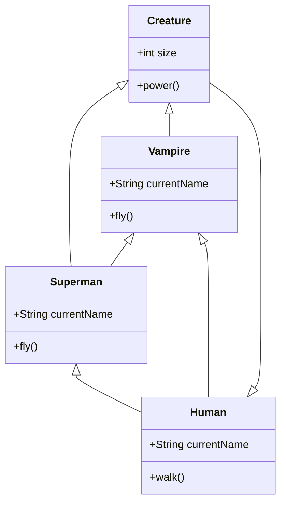
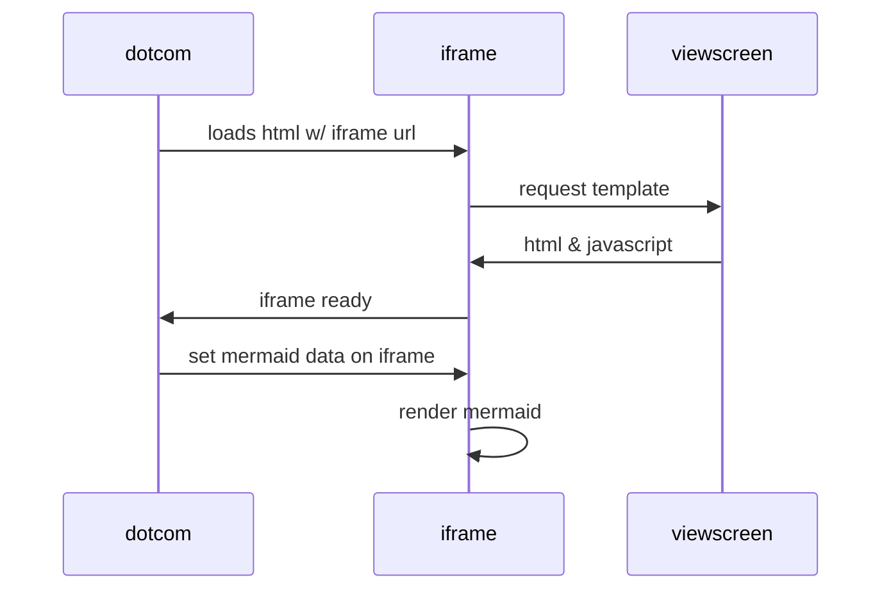

# TestKEK.md
This is a TestKEK. 

First install `Markdown Preview Mermaid Support`.

:::mermaid
stateDiagram-v2
    [*] --> Active
    state Active {
        [*] --> NumLockOff
        NumLockOff --> NumLockOn : EvNumLockPressed
        NumLockOn --> NumLockOff : EvNumLockPressed
        --
        [*] --> CapsLockOff
        CapsLockOff --> CapsLockOn : EvCapsLockPressed
        CapsLockOn --> CapsLockOff : EvCapsLockPressed
        --
        [*] --> ScrollLockOff
        ScrollLockOff --> ScrollLockOn : EvScrollLockPressed
        ScrollLockOn --> ScrollLockOff : EvScrollLockPressed
    }    
:::

:::mermaid
journey
    title Home office day
    section Go to work
      Wake up: 1: Me, Dog
      Take shower: 2: Me
      Go downstairs: 3: Me, Dog
      Make coffee: 4: Me
      Have a breakfast: 5: Me, Dog
      Go upstairs: 3: Me, Dog
      Do work: 1: Me, Dog
    section Go home
      Go downstairs: 3: Me, Dog
      Sit down: 5: Me
:::

Click for pie!

:::mermaid
pie title Fishermans in countries
    "Norway" : 684
    "Sweden" : 234
    "Switzerland" : 10
:::

