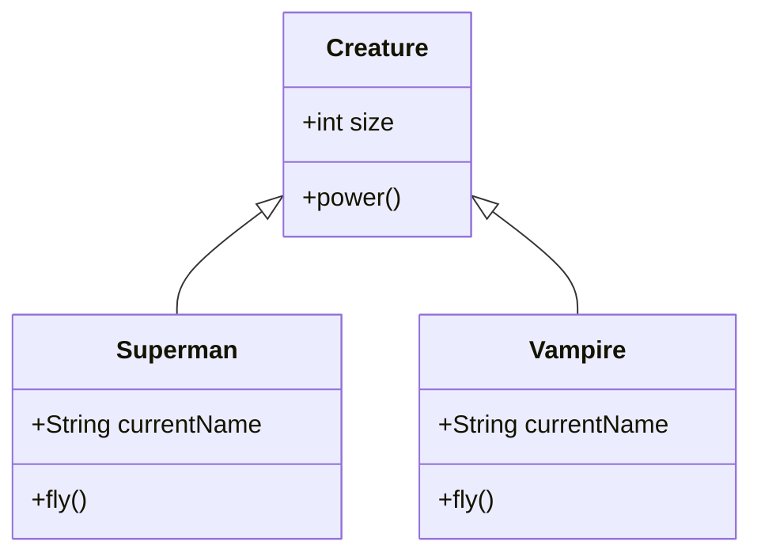
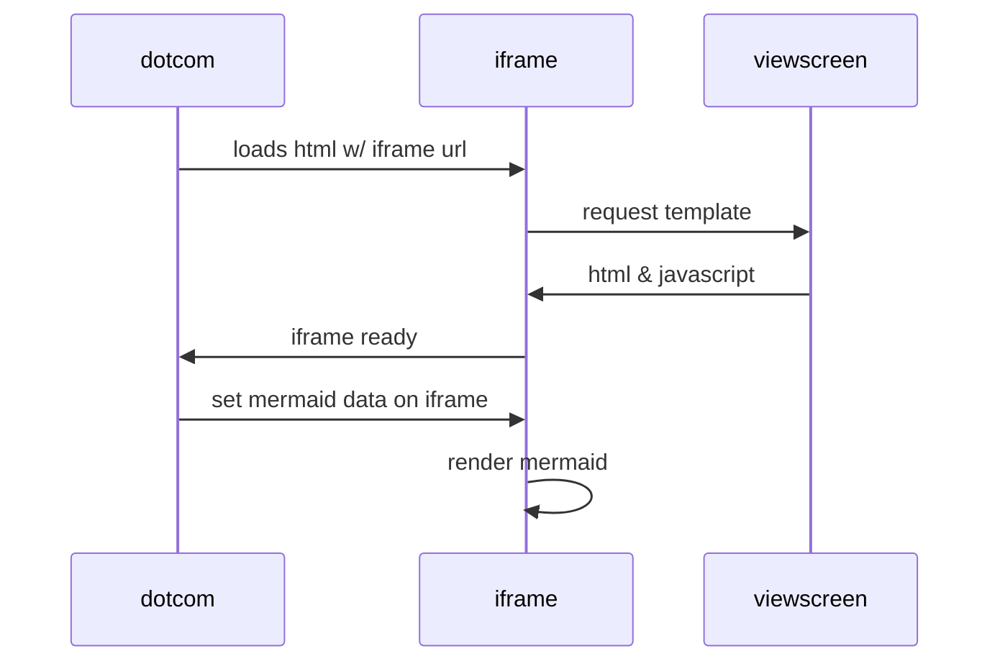

# TestKEK.md
This is a TestKEK.
First install Markdown Preview Mermaid Support.

```mermaid
classDiagram
    Creature <|-- Superman
    Creature <|-- Vampire
    Creature: +int size
    Creature: +power()
    class Superman{
        +String currentName
        +fly()
    }
    class Vampire{
        +String currentName
        +fly()
    }
```

```mermaid
sequenceDiagram
    participant dotcom
    participant iframe
    participant viewscreen
    dotcom->>iframe: loads html w/ iframe url
    iframe->>viewscreen: request template
    viewscreen->>iframe: html & javascript
    iframe->>dotcom: iframe ready
    dotcom->>iframe: set mermaid data on iframe
    iframe->>iframe: render mermaid
```